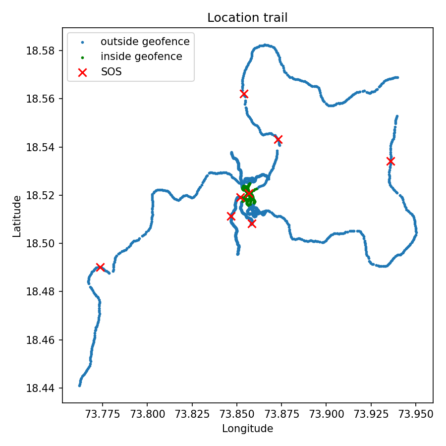
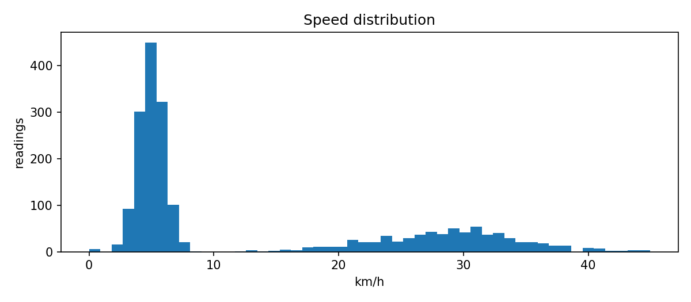

# SafeTrack Analytics

ETL pipeline and SQL analysis on GPS location data from **SafeTrack**, my ESP32 + NEO-7M real-time safety tracker.

> **Data note:** *(EDIT THIS: write either "Data exported from my SafeTrack Supabase database" or "Simulated data mimicking SafeTrack's GPS output, since real device data was limited". Be honest.)*

## Pipeline
`raw CSV -> clean -> transform -> load (SQLite) -> SQL analysis -> charts`

1. **Extract:** read raw GPS readings (device_id, latitude, longitude, timestamp, sos)
2. **Clean:** remove duplicates, missing values, invalid coordinates and (0,0) "no fix" readings
3. **Transform:** compute distance (Haversine), time gap and speed between readings; flag physically impossible jumps (>120 km/h) as GPS glitches; flag geofence status
4. **Load:** store `locations` and `gps_glitches` tables in SQLite
5. **Analyse (SQL):** daily distance and speed, hourly activity, geofence exits (window function `LAG`), SOS events, walking vs vehicle classification
6. **Visualise:** location trail and speed distribution (matplotlib)

## Run
```bash
pip install -r requirements.txt
# put your export at data/raw_locations.csv  (or: python generate_sample_data.py)
python pipeline.py
```

## Results
*(EDIT: paste 2-3 real numbers from your run, e.g. "Cleaned X raw rows to Y, flagged Z GPS glitches, detected N geofence exits.")*




## Tech
Python, pandas, NumPy, SQL (SQLite, window functions), matplotlib
